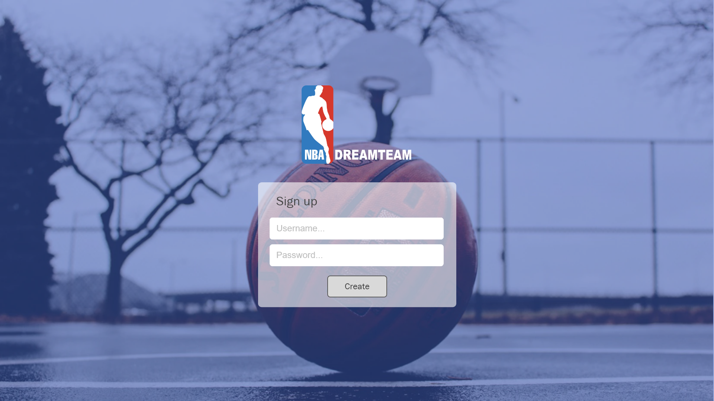
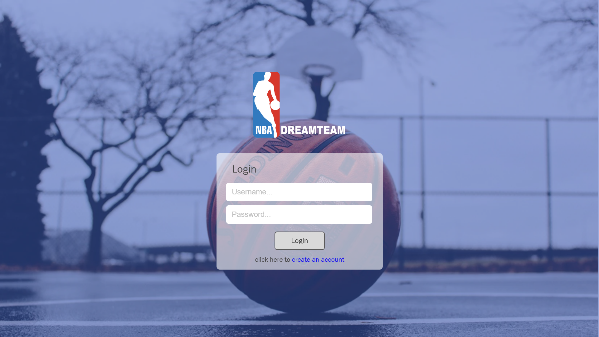
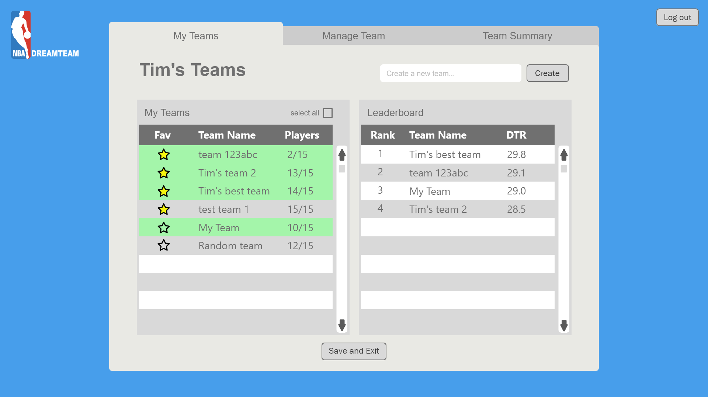
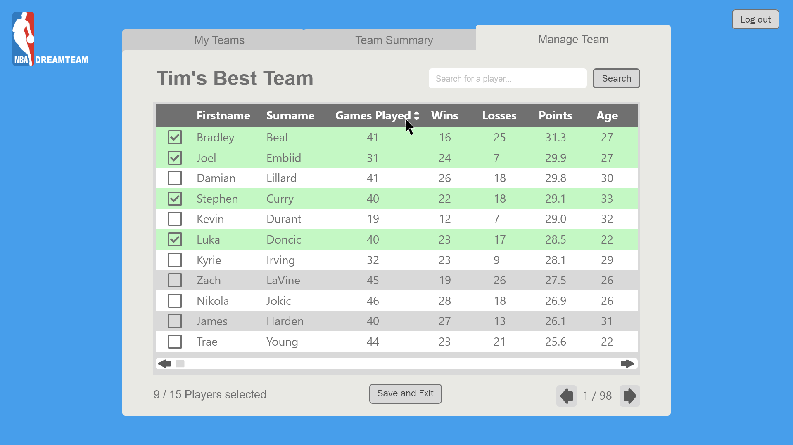
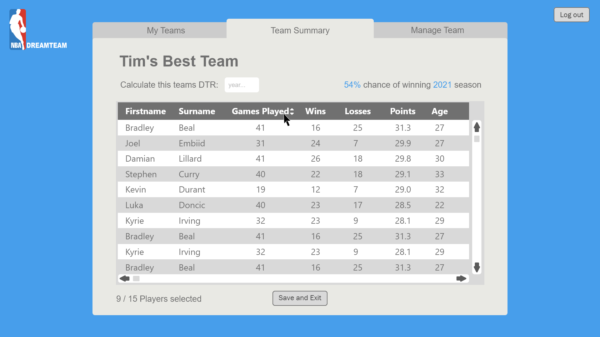

# NBA_Prediction-API
## Introduction
The API is built for the NBA_Prediction web application, it's built on ASP.NET core and includes ASP.NET Identity system to support role-based authentication and secure the application.  
[The Front end of the application can be found here]( https://github.com/Xiaoxiao0508/NBA-FrontEnd.git)  
## Install
Clone the git repository to local directory
## Run the API
run dotnet run in the terminal
open https://localhost:5001 on postman
or open Swagger UI https://localhost:5001/swagger/index.html to view the endpoints
## NBA_Prediction-API
The API is described in more details below
The user will sign up or login in at the homepage
### POST/User/Register
#### POST/User/Login

Once login, the user can view the existing teams or create a new team or remove a team or set the favourite teams, the user can also generate the leader board for selected teams to rank the DTR  (Dream team rating which is calculated based on the algorithm that created to indicate a team’s winning chance) scores.  
### POST/Team/addteam  
### GET/Team/getteams  
### PUT/Team/deleteteam  
### PUT/Team/setfavorites  
  
By navigate to manage team tab, a user can see all the players from database with pagination applied, user is able to sort player by various statics, search certain player and add players to a team  
### GET/Player
### GET/Player/SearchPlayer
### PUT/PlayerSelection/UpdatePlayerSelection

 
When navigate to team summary tab, a user can see players in the selected team and the DTR score of the team.  
### POST/Player/get Players from Team
   
